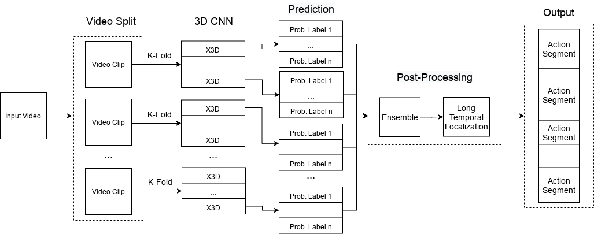

# AICITY2022_Track3
This repo includes solution for AICity2022 Challenge Track 3 - Naturalistic Driving Action Recognition


# Installation
Please find installation instructions for PyTorch and PySlowFast in [here](https://github.com/facebookresearch/SlowFast/blob/main/INSTALL.md)

# Data Preparation For Training
Download the training data (A1), which is provided by 2022 ACity Challenge and put the download file into ./X3D_training/

Note: Due to the file name in .csv file and the file name of videos (.mp4) are not matching (for example, **Rear_view_User_id_49381_1**(in .csv file) and  **Rearview_mirror_user_id_49381_NoAudio_1** (in video files)), we should change the file names in csv file (user_id_*.csv) similar to the file name of coresponding videos. 

Futhermore, for the synchronization, please change the name of csv file in **user_id_49381 folder** of the download data from  **User_id_49381.csv** to **user_id_49381.csv**

```bash
cd X3D_training
```
Splitting training data into multiple video segments using the following command (around 04 hours of time consuming):
```bash
python cut_video.py
```
After executing the above command, the output data is located in ./X3D_training/data/
 
The Dataset is then splitted into video segments and put into different folder of labels based on ground truth (user_id_*.csv). The splitted files is formated as follows:

>   * data
>     * 0
>       * VIDEO1.MP4
>       * VIDEO2.MP4
>       * VIDEO3.MP4
>       * ...
>       ...
>     * 17
>       * VIDEO1.MP4
>       * VIDEO2.MP4
>       * VIDEO3.MP4


The next step is to create the ground truth (.csv files) of the splitting data which categorized into trainning (`train_cameraview_id.csv`), validation (`val_cameraview_id.csv`) and testing (`test_cameraview_id.csv`) using the following command:

```bash
python create_csv.py
```
After executing the above command, the output data is located in ./X3D_training/data/ .The ground truth files is formated as follows:

>   * data
>     * train_cameraview_id.csv
>       ...
>     * val_cameraview_id.csv
>       ...
>     * test_cameraview_id.csv
>       ...

The content of *.csv files are formated as follows:

>       * path_to_video_1 label_1
>       * path_to_video_2 label_2
>       * path_to_video_3 label_3
>       ...
>       * path_to_video_N label_N


# Reproduce the result on AICity 2021 Challenge
## Train
Pretrained model of X3D-L can be download [here](https://drive.google.com/drive/folders/1UwhvMoCf36y82KN5rd7ZHzrv1-aTWprl?usp=sharing). After downloading the pretrained model, please put the file into ./X3D_training/
```bash
cd X3D_training
```
```bash
python tools/run_net.py --cfg configs/Kinetics/X3D_L.yaml NUM_GPUS 1 DATA.PATH_TO_DATA_DIR data
```
Outputs of the trainning process (i.e., checkpoint) are saving in the main folder, which are formated as `checkpoint_cameraview_id`

Note: We execute the training with A100 GPU. For other GPU, please change the value of  batch size in ./Training/configs/Kinetics/X3D_L.yaml

## Inference
The format of inference should be similar with the A2 dataset, which is provided by 2022 AI City Challenge. The format of A2 dataset as follows:
>   * A2
>     * user_id_*
>       * CAMERAVIEW_user_id_*.MP4
>       * CAMERAVIEW_user_id_*.MP4
>       * CAMERAVIEW_user_id_*.MP4
>       * ...
>     * video_ids.csv

The checkpoints after trainning process can be downloaded [here](https://drive.google.com/drive/folders/1X99U2yekGOLeqlmD91lI554BjNc_3fOA?usp=sharing), which includes all the checkpoints of different camera views and user id. After downloading all the checkpoints, please put all files into ./X3D_inference/checkpoint_submit/
```bash
cd X3D_inference
```
```bash
python inference_ensemble_3_view.py --cfg configs/Kinetics/X3D_L.yaml NUM_GPUS 1 TRAIN.ENABLE False DATA.PATH_TO_DATA_DIR A2
```
DATA.PATH_TO_DATA_DIR: path to Test Dataset (e.g., A2, B)
Submission file appeare in ./output

## Public Leaderboard
|TeamName|F1-Score|Link|
|--------|----|-------|
|**VTCC_uTVM**|0.3492|


## Citation

If you find our work useful, please cite the following:

```text
@inreview{Tran2022,  
    author={Manh Tung Tran and Minh Quan Vu and Ngoc Duong Hoang and Khac-Hoai Nam Bui},  
    title={An Effective Temporal Localization Method with Multi-View 3D Action Recognition for Untrimmed Naturalistic Driving Videos},  
    booktitle={CVPR Workshop},
    year={2022}  
}
```

## Contact
Khac-Hoai Nam Bui (nambkh@viettel.com.vn)
Manh Tung Tran (tungtm6@viettel.com.vn)
Minh Quan Vu (quanvm4@viettel.com.vn)
